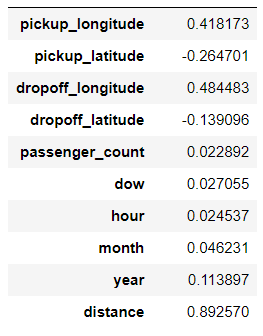

# NYC - Taxi Fare Prediction 
This project is an attempt to build a complete package on predicting the New York Taxi Fare (inclusive of tolls), based on the [Kaggle Challenge](https://www.kaggle.com/competitions/new-york-city-taxi-fare-prediction). This is a playground competition, hosted in partnership with Google Cloud and Coursera.
While basic estimate based on just the distance between the two points will result in an RMSE of $5-$8, depending on the model used. The challenge is to do better using Machine Learning techniques!

Original Train and Test file can be found through this kaggle [link](https://www.kaggle.com/competitions/new-york-city-taxi-fare-prediction/data). It is not uploaded due to the file size (5GB). 

# File Description
1. TaxiFareModel contains all the necessary .py file for training of the model. 
    1. \_init\_.py - for indication of this whole folder as a package for packgenlite
    2. data.py - for reading of data from the raw_data folder ( as mentioned earlier gitignored due to file size ) and also data cleaning.
    3. encoders.py - feature engineering based on given data
    4. trainer.py - building and training of model
    5. utils.py - utility functions to separate out from trainer.py   
2.  notebook - Jupyter Notebook for testing and trial run.
3.  predict.py - To predict the taxi fare price based on saved model.

# Problem Statement
The task is to predict the taxi fare based on the pick up location, drop off location, and pick up timing. Benchmark model for this challenge can be seen as per this [linear model](https://www.kaggle.com/code/dster/nyc-taxi-fare-starter-kernel-simple-linear-model/notebook). The benchmark RMSE is 5.74 as per given linear model, and we aim to do that with further tuning and exploration of other machine learning models, and also any deep learning model if possible.

# 1. Data Extraction and Exploration
Initial exploration of data is conducted by dropping of outliers, illogical data ( trip with 0 passengers, negative fares etc... ). We check the correlation of the data with the fare amount. It shows that distance is most correlated with fare amount as hypothesized with a correlation of 89.26% (range of 0 to 1, therefore 0.8926).

  

Please note that the distance is calculated using longitude and latitude and therefore not taken into consideration during analysis of correlation of individual features. Else parameters like day of week, hour, month, years are all extracted from pickup timing. 
The exploration of the relationships of other variables against taxi fare can be seen from the [Jupyter Notebook](notebooks/Taxi-Fare-Model.ipynb). Here, we'll only show the scatter plot of the taxi fare when plotted against distance, where there is an obvious linear pattern that can be identified through the graph.

  

The second feature most highly correlated with fare amount will be year attribute extracted from pick up time. This is presume due to the rising taxi fare cost by inflation. The correlation of year and taxi fare is only around 11%.

# 2. Model building and training
A pipeline was build using scikit-learn. It includes distance transformer for distance calculation, standardscaler for standardization, and one hot encoding for the features extracted from the pickup time.  
RandomizedSearchCV is used to determine the best model, and MLflow is being used to track all the parameters results. After comparison, RandomForestRegressor is shown to have the best result, an average RMSE of 4.298. The optimum hyperparameters is also determined using the same method. Tuned model after train_test_split of 0.15, the model after train and evaluate is able to achieve RMSE of 4.644. 

# 3. Prediction and Deployment
The model is saved as joblib and deployed directly with streamlit due to its small size. The whole package is then hosted onto Heroku. Due to limitations the model is currently trained on 1 million rows.

## Input stage
- User are required to key in the Date & Time, Number of passengers, Pickup & Dropoff Address in order to predict. 
- User after input their location and press enter, the input will be send to the API to check for places that matched and it will be shown below.
- For multiple areas with similar names, all names will be listed for selection. User is required to copy the intended address to paste back into the input box.
- If the intended address is not listed, User is required to refine their search.

## Prediction Stage
- Once all input is confirmed, click the predict button and the calculated fare will be shown.
- Error or invalid fare notification appears when the input address is not within New York City, or illogical address ( e.g. empty or random symbols )

|Input stage|Prediction stage|
|:---|:---|
|||

# 4. Limitations and Improvements
- Currently the model only works for predicting taxi fare within New York City. It'll be able to calculate taxifare of other cities too when trained with the dataset of the other cities.
- Currently the model is only trained on 1 million of the data due to limitations. The model can be more accurate if it can be trained with all data through Cloud or Google Colab. 

### The sample model website can be accessed through this link ([NYC Taxi Prediction Interface](https://taxifare-yongsin91.herokuapp.com/))
